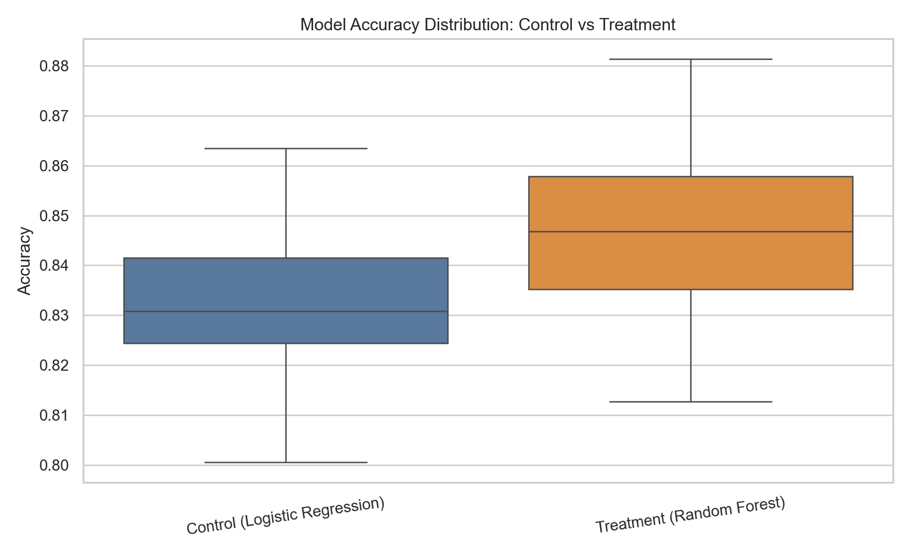
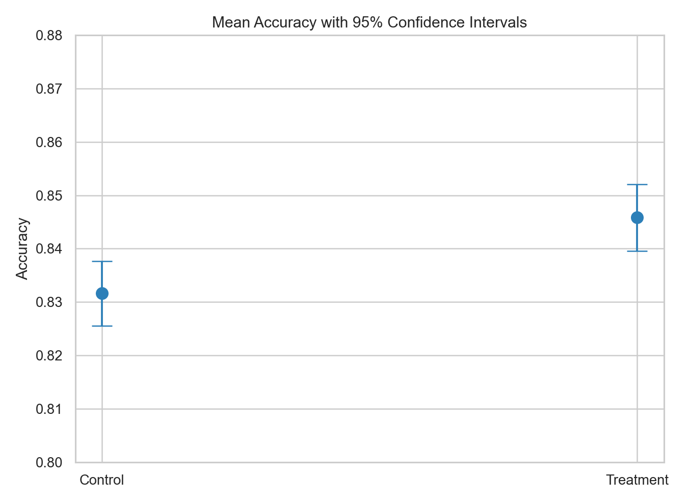
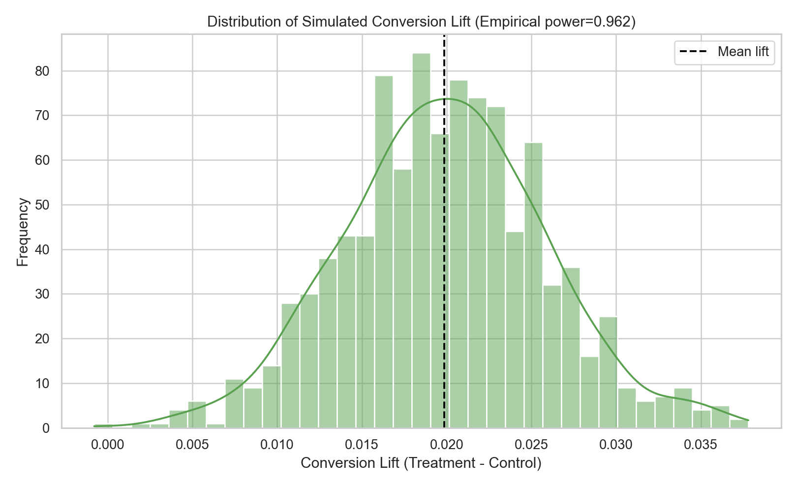

# Machine Learning Methodology: Modeling + Experimental Design

This repository presents a machine learning workflow extended with an experimentation layer for statistically defensible decision-making.

## Project Scope

Core ML capabilities:
- Model training and hyperparameter tuning
- Model comparison across algorithms
- Predictive performance diagnostics and visualization

Experimental analytics capabilities:
- Hypothesis testing
- Confidence intervals
- Power analysis
- A/B testing simulation
- Structured experiment design templates

---

## Credit Risk Modeling and Tree-based Benchmarking

Using German credit risk data, this module builds and evaluates interpretable and ensemble models under a consistent train/test and cross-validation setup.

What is covered:
- Pruned decision tree training and interpretation
- Random forest tuning with `ntree = 1000`
- Comparative error-rate and ROC-AUC evaluation
- Feature importance interpretation for model governance

Reference visualizations:


## Nonlinear Multi-class Classification with Kernel SVM

This module simulates a non-linearly separable three-class dataset and evaluates linear, polynomial, and RBF kernels to demonstrate boundary flexibility vs. generalization.

What is covered:
- Synthetic nonlinear data generation
- 5-fold CV parameter tuning for each kernel
- Holdout-set comparison of predictive quality
- Decision-boundary behavior across kernel choices

Reference visualizations:


## Robustness Evaluation via Repeated-split AUC Analysis

This module compares kNN and LDA under repeated random train/test splits to evaluate variance, stability, and reliability in out-of-sample performance.

What is covered:
- Repeated 70/30 data partitions
- CV tuning for kNN over candidate `k`
- AUC collection across repeated runs
- Distribution-based model robustness comparison

Reference visualization:


## Stratified K-fold Index Engineering

This module implements a custom function that generates class-balanced training indices for K-fold workflows, useful when teams need transparent control over fold construction.

What is covered:
- User-defined fold index generation
- Class-balance control by construction
- Reproducibility via explicit seed handling
- Fold-wise training index output for downstream pipelines

---

## Experimental Evaluation Layer (New)

### A/B Testing for Model Comparison

Notebook:
- `notebooks/ab_testing_experiment.ipynb`

Experiment setup:
- Control: Logistic Regression
- Treatment: Random Forest

Statistical components implemented:
1. Two-sample t-test (hypothesis testing)
2. 95% confidence intervals
3. Power analysis and sample-size estimation
4. Conversion-rate A/B simulation with z-test
5. Monte Carlo simulation of detection performance

### New Visualizations from Experimental Analysis

Model score distribution:



Mean performance with uncertainty bands:



Simulated conversion lift distribution:



### Conversion Simulation Utility

Script:
- `simulate_user_conversion.py`

Example:

```bash
python simulate_user_conversion.py \
  --control-rate 0.08 \
  --treatment-rate 0.10 \
  --control-n 5000 \
  --treatment-n 5000 \
  --simulations 2000
```

Outputs:
- Observed lift
- z-statistic and one-sided p-value
- 95% confidence intervals
- Empirical power estimate from simulation

### Reusable Experiment Playbook

Template:
- `experiment_design.md`

Includes:
- Objective and hypothesis framing
- Primary + guardrail metric design
- Statistical test planning
- Power/sample-size planning
- Decision gates for rollout decisions

---

## Experiment Design Framework

1. Define hypothesis
2. Define metrics
3. Run experiment
4. Evaluate statistical significance
5. Quantify confidence intervals
6. Validate power and sample-size assumptions

---

## Repository Structure

```text
Machine_Learning_Methodology/
├── Practice_1.R
├── Practice_2.R
├── Practice_3.R
├── Practice_4.R
├── churn.csv
├── assets/
│   ├── ab_accuracy_distribution.png
│   ├── ab_mean_ci.png
│   └── ab_conversion_lift_distribution.png
├── experiment_design.md
├── notebooks/
│   └── ab_testing_experiment.ipynb
├── simulate_user_conversion.py
└── README.md
```

---

## Environment

R stack (existing scripts):
- `caret`, `rattle`, `pROC`, `ggplot2`, `e1071`, `simstudy`

Python stack (experimentation layer):

```bash
pip install numpy pandas scipy matplotlib seaborn jupyter
```

---

## Professional Relevance

This repository demonstrates the ability to combine machine learning evaluation with statistical decision frameworks, including:
- experimental design and A/B testing
- inference and uncertainty quantification
- repeatable analytical templates for team adoption
- evidence-based ship/no-ship evaluation logic
